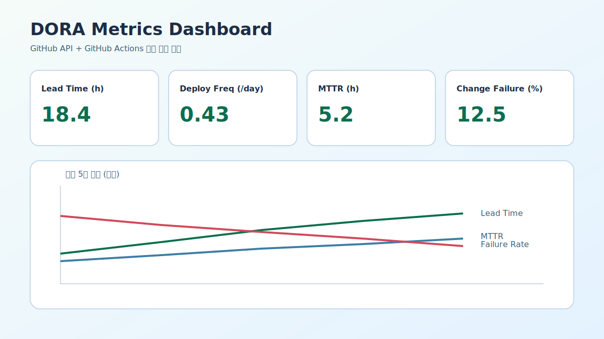

# 📌 L02: DORA 메트릭 수집 자동화

## ✅ 완료 항목

### DORA 4대 지표 자동 수집
- GitHub Actions로 자동 수집 구현 완료
- Lead Time for Changes: 최근 30일 내 PR 머지 시간
- Deployment Frequency: 일단위 배포 빈도
- Change Failure Rate: 배포 실패율
- MTTR: 이슈 복구 시간

**워크플로우:** `.github/workflows/dora-metrics.yml`  
**수집 스크립트:** `assignments/L02/collect_dora_metrics.py`

### 산출 파일
- `latest.json` - 최신 DORA 지표 스냅샷
- `history.json` - 날짜별 추이 데이터

### 대시보드 구현
- Chart.js 기반 실시간 대시보드 (HTML)
- 메트릭 카드 및 추세 차트 표시
- `history.json`과 `latest.json` 자동 연동

**구현 파일:** `assignments/L02/dora-dashboard.html`

