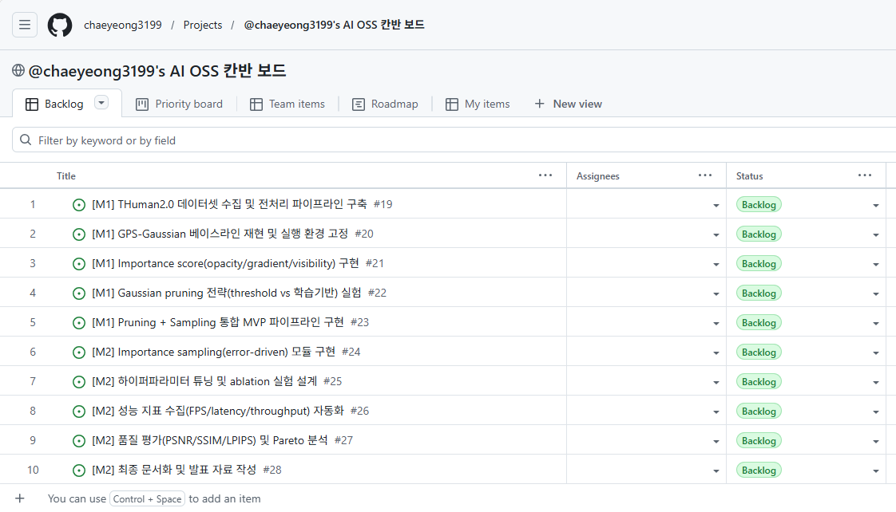

# 📌 L03: GitHub Projects 계획·추적 체계 구축

칸반 기반 GitHub Project를 생성하고 상태 컬럼(Backlog/To Do/In Progress/Review/Done)을 구성한다.
10개 이상 이슈, 템플릿(Bug/Feature), 라벨 체계, 2개 마일스톤을 포함한 스프린트 운영용 백로그를 만든다.

---

## ✅ 수행 결과 체크리스트

- [x] GitHub Project 생성 완료
	- Project: `@chaeyeong3199's AI OSS 칸반 보드` (Project #1)
	- URL: [https://github.com/users/chaeyeong3199/projects/1](https://github.com/users/chaeyeong3199/projects/1)
- [x] 상태 컬럼 구성 완료
	- 기본 Status: Backlog / Ready / In progress / In review / Done
	- 과제 요구 이름과 동일한 커스텀 필드 `Kanban Status` 추가: Backlog / To Do / In Progress / Review / Done
- [x] 2개 Milestone 구성 완료
	- AI OSS 중간 점검 (W1-8)
	- URL: [https://github.com/chaeyeong3199/AIOSS/milestone/2](https://github.com/chaeyeong3199/AIOSS/milestone/2)
	- AI OSS 프로젝트 완성
	- URL: [https://github.com/chaeyeong3199/AIOSS/milestone/1](https://github.com/chaeyeong3199/AIOSS/milestone/1)
- [x] 10개 이슈 생성 및 milestone 연결 완료 (#19~#28)
	- 이슈 목록 URL: [https://github.com/chaeyeong3199/AIOSS/issues](https://github.com/chaeyeong3199/AIOSS/issues)
	- 대표 이슈 URL: [#19](https://github.com/chaeyeong3199/AIOSS/issues/19), [#28](https://github.com/chaeyeong3199/AIOSS/issues/28)
- [x] 이슈 템플릿 2종 추가 완료
	- `.github/ISSUE_TEMPLATE/bug_report.yml`
	- URL: [https://github.com/chaeyeong3199/AIOSS/blob/main/.github/ISSUE_TEMPLATE/bug_report.yml](https://github.com/chaeyeong3199/AIOSS/blob/main/.github/ISSUE_TEMPLATE/bug_report.yml)
	- `.github/ISSUE_TEMPLATE/feature_request.yml`
	- URL: [https://github.com/chaeyeong3199/AIOSS/blob/main/.github/ISSUE_TEMPLATE/feature_request.yml](https://github.com/chaeyeong3199/AIOSS/blob/main/.github/ISSUE_TEMPLATE/feature_request.yml)
- [x] 라벨 체계 구축 및 일괄 적용 완료
	- type / status / priority / area 라벨 추가
	- URL: [https://github.com/chaeyeong3199/AIOSS/labels](https://github.com/chaeyeong3199/AIOSS/labels)
	- M1(#19~#23): `status:todo`
	- M2(#24~#28): `status:backlog`
- [x] Project 아이템 등록 완료
	- #19~#28 이슈 10개를 Project #1에 추가
	- `Kanban Status` 기준으로 M1은 To Do, M2는 Backlog로 초기 배치

## 메모

- GitHub CLI에서 기본 `Status` 필드의 옵션명 변경은 제한적이어서,
	과제 요구 컬럼명 일치를 위해 커스텀 단일 선택 필드(`Kanban Status`)를 사용했다.

## 📷 스크린샷

- GitHub Project 보드 구성 및 이슈 배치 화면

