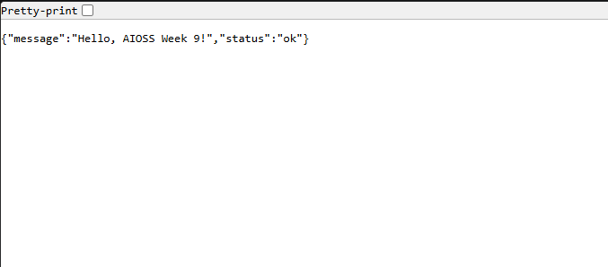

# 📌 L09: npm 패키지 배포, Docker 자동화, 보안 스캔/Dependabot 설정

9주차 과제에서는 npm 패키지를 GitHub Packages에 배포할 수 있도록 설정하고, Docker 이미지를 자동으로 빌드/푸시하도록 구성했다.
또한 Dependabot 정책과 npm audit/Snyk 기반 보안 점검 결과를 자동으로 기록·공유하도록 워크플로우를 정리했다.


## 제출 내용
- npm 패키지 설정 및 버전 갱신: [`package.json`](../../package.json)
- GitHub Packages 배포 워크플로우: [`.github/workflows/node-package.yml`](../../.github/workflows/node-package.yml)
- Docker 자동 빌드/푸시 워크플로우: [`.github/workflows/docker-publish.yml`](../../.github/workflows/docker-publish.yml)
- Dependabot 정책: [`.github/dependabot.yml`](../../.github/dependabot.yml)
- Dependabot 자동 머지 워크플로우: [`.github/workflows/dependabot-auto-merge.yml`](../../.github/workflows/dependabot-auto-merge.yml)
- 보안 스캔 워크플로우: [`.github/workflows/security-scan.yml`](../../.github/workflows/security-scan.yml)

## 구현 요약
- `package.json` 버전을 `1.0.0`에서 `1.0.1`로 올리고, `publishConfig.registry`를 `https://npm.pkg.github.com`으로 지정해 GitHub Packages 배포가 가능하도록 했다.
- `node-package.yml`에서 `main` 브랜치와 `v*.*.*` 태그 기준으로 테스트 후 `npm publish`를 실행하도록 구성했다.
- `docker-publish.yml`에서 GitHub Container Registry로 이미지를 자동 빌드/푸시하고, 기본 브랜치에는 `latest` 태그가 붙도록 설정했다.
- `dependabot.yml`에서 npm, Docker, GitHub Actions 업데이트를 주 1회 스케줄로 점검하고, production/development 의존성을 그룹화했다.
- `dependabot-auto-merge.yml`에서 patch/minor 업데이트만 자동 승인 및 auto-merge하고, major 업데이트는 수동 검토로 남기도록 했다.
- `security-scan.yml`에서 `npm audit` 결과를 JSON/마크다운 리포트로 저장하고, 취약점이 있으면 GitHub Issue를 자동 생성하거나 갱신한다.
- 같은 워크플로우에서 `SNYK_TOKEN`이 있으면 Snyk 스캔을 실행하고 결과를 아티팩트로 업로드한다.

## 로컬 검증

다음 명령으로 GHCR 이미지를 pull/run하고 HTTP 응답을 확인했다.

```powershell
docker --version
docker pull ghcr.io/chaeyeong3199/aioss:latest
docker run -d --rm -p 3001:3000 --name aioss-l09-proof ghcr.io/chaeyeong3199/aioss:latest
curl http://localhost:3001
docker ps --filter "name=aioss-l09-proof"
docker stop aioss-l09-proof
```

실행 결과 핵심:

- Docker 버전: `27.0.3`
- 이미지 digest: `sha256:34a42adeae58dfc19686ad477b84bb2411ffe3e3dd414853b75b7323e56e50d4`
- HTTP 응답: `StatusCode 200`, 본문 `{"message":"Hello, AIOSS Week 9!","status":"ok"}`
- 컨테이너 상태: `Up` 확인 후 정상 종료



## 체크리스트

- [x] 버전 업데이트(`1.0.0 -> 1.0.1`) 반영
- [x] GitHub Packages 배포 워크플로우 반영
- [x] Docker 자동 빌드/푸시 워크플로우 반영
- [x] 로컬 컨테이너 실행 및 응답 검증 완료
- [x] Dependabot 스케줄/그룹/자동머지 조건 반영
- [x] npm audit/Snyk 보안 스캔 및 리포트/이슈 자동화 반영

## GitHub 바로가기 링크

- Version Update: https://github.com/chaeyeong3199/AIOSS/pkgs/npm/aioss
- Node Package Publish: https://github.com/chaeyeong3199/AIOSS/actions/workflows/node-package.yml
- Docker Build and Publish: https://github.com/chaeyeong3199/AIOSS/actions/workflows/docker-publish.yml
- Security Scan: https://github.com/chaeyeong3199/AIOSS/actions/workflows/security-scan.yml
- Dependabot Auto Merge: https://github.com/chaeyeong3199/AIOSS/actions/workflows/dependabot-auto-merge.yml

---

※ 본 README 및 과제 산출물의 일부 코드/문서는 생성형 AI 도구의 도움을 받아 작성되었습니다.