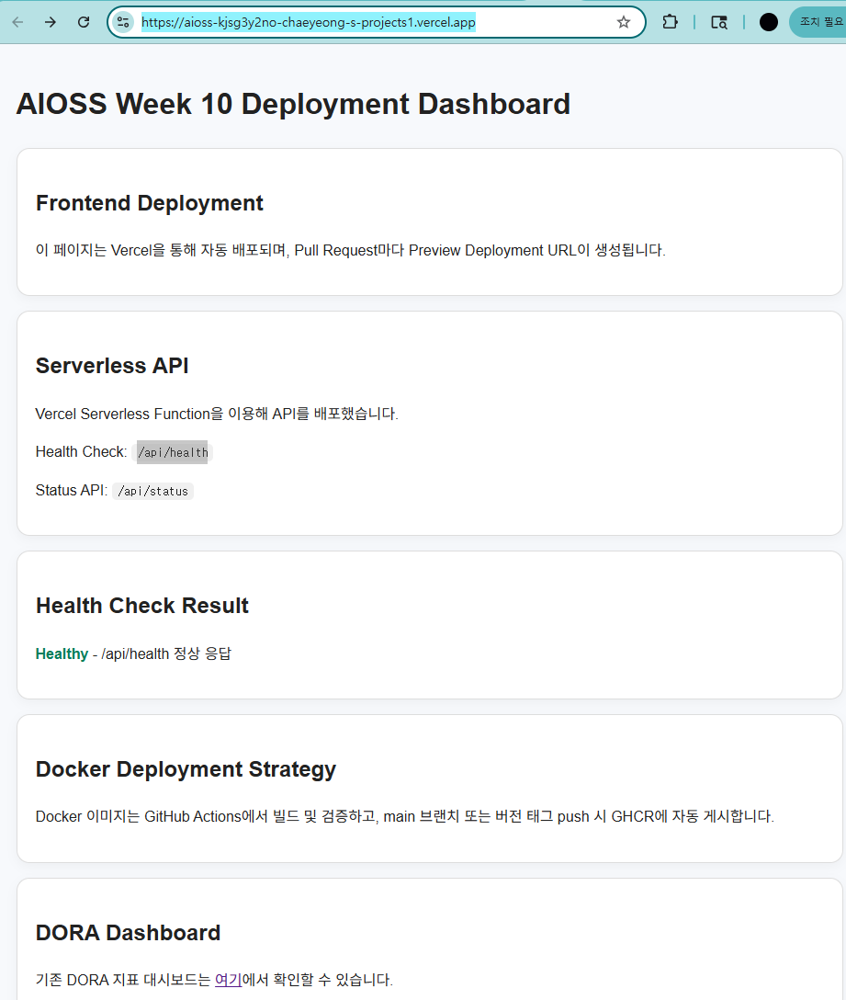
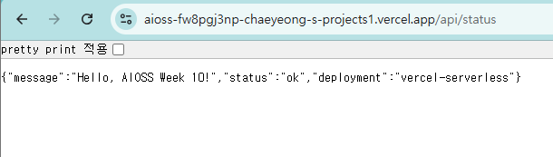
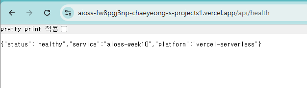

# 10주차 과제 - 자동 배포 및 모니터링

## 과제 목표
이번 주차에서는 프런트엔드 자동 배포, PR 프리뷰 환경, Docker 기반 배포 파이프라인, 그리고 서버리스 헬스체크/모니터링 구성을 정리했다.

## 구현 내용

### 1. 프런트엔드 자동 배포 및 PR 프리뷰
- 배포 플랫폼: **Vercel**
- 정적 프런트엔드는 `public/` 폴더 기준으로 배포되도록 구성했다.
- `vercel.json`에서 `/` 요청을 `index.html`로 리라이트하여 SPA처럼 동작하도록 설정했다.
- Pull Request가 생성되면 Vercel Preview Deployment URL이 자동으로 생성되는 흐름을 기대하도록 문서와 화면을 구성했다.

### 2. Docker 기반 배포 파이프라인 전략
- Docker 이미지는 `Dockerfile` 기준으로 Node.js 20 Alpine 이미지에서 빌드된다.
- GitHub Actions의 `docker-publish.yml`에서 다음 흐름을 적용했다.
	- PR 생성 시: 이미지 빌드 및 컨테이너 스모크 테스트 실행
	- `main` 브랜치 push 시: GHCR에 이미지 자동 게시
	- 버전 태그 push 시: 릴리스용 이미지 태그 자동 게시
- 컨테이너 검증은 `/health` 엔드포인트를 호출해 기본 동작을 확인한다.

### 3. 서버리스 또는 컨테이너 배포 자동화
- 선택 플랫폼: **Vercel**
- `api/health.js`와 `api/status.js`를 통해 서버리스 API를 배포했다.
- `/api/health`는 헬스체크용 응답을 반환하고, `/api/status`는 상태 정보를 반환한다.
- 프런트엔드 페이지에서도 `/api/health`를 호출해 상태를 표시하도록 구성했다.

### 4. 헬스체크 및 모니터링
- 애플리케이션 레벨 헬스체크: `/health`
- 서버리스 헬스체크: `/api/health`
- 상태 확인용 API: `/api/status`
- 프런트엔드 대시보드에서 헬스체크 결과를 화면에 노출해 배포 후 상태를 빠르게 확인할 수 있게 했다.

## 핵심 파일
- [vercel.json](../../vercel.json)
- [Dockerfile](../../Dockerfile)
- [.github/workflows/docker-publish.yml](../../.github/workflows/docker-publish.yml)
- [api/health.js](../../api/health.js)
- [api/status.js](../../api/status.js)
- [public/index.html](../../public/index.html)

## 배포 워크플로우 / 라이브 URL
- 배포 워크플로우: GitHub Actions의 [.github/workflows/docker-publish.yml](../../.github/workflows/docker-publish.yml)
- 프런트엔드 라이브 URL: https://aioss-kjsg3y2no-chaeyeong-s-projects1.vercel.app/
- PR 프리뷰 URL: https://github.com/chaeyeong3199/AIOSS/pull/35

## 결과 정리
10주차 과제에서는 Vercel 기반 프런트엔드 자동 배포, PR 프리뷰, Docker 이미지 빌드 및 레지스트리 게시, 서버리스 헬스체크를 하나의 배포 전략으로 연결했다. 배포 후에는 `/api/health`와 `/health`를 기준으로 정상 동작 여부를 확인한다.

---

※ 본 README 및 과제 산출물의 일부 코드/문서는 생성형 AI 도구의 도움을 받아 작성되었습니다.